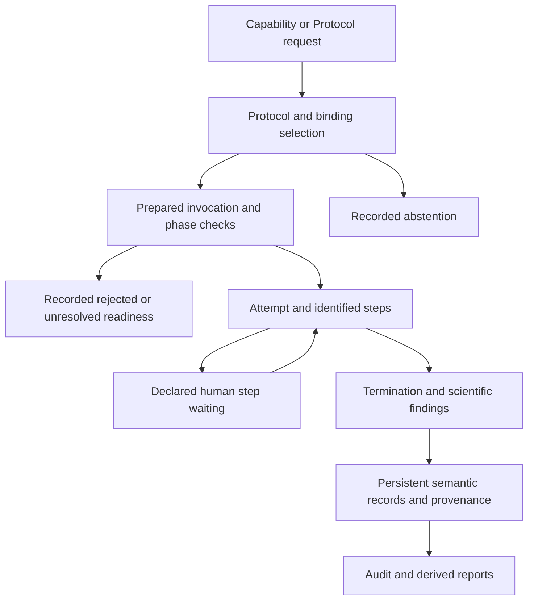

# Initial Praxis programming design

## Purpose and status

**Draft for discussion.** Praxis would provide a versatile Python environment
for registering, documenting, executing, benchmarking, auditing, and reporting
reusable scientific methodology. The first implementation would be local, with
interfaces that allow additional providers, methods, and storage backends.

The experimental local increment is now frozen as
[0.1.0](../releases/0.1.0.md). [FIRST_SLICE.md](../FIRST_SLICE.md) is authoritative
for implemented behavior; the [issue acceptance record](../releases/0.1.0.md#issue-acceptance-and-remaining-work)
identifies completed local criteria and remaining shared/scientific work. Future
tense and open questions below preserve the broader design discussion and do not
mean that every interface is still unimplemented.

The structure separates scientific definitions, executable implementations,
persistent operation records, and derived views. Experimental definitions can
be inspected and documented before all provider tools exist. Execution,
benchmarks, audit, and reports share exact method references and provenance.

[Praxis #1](https://github.com/uibcdf/praxis/issues/1) owns the initial implementation.
[Praxis #3](https://github.com/uibcdf/praxis/issues/3) supplies the hydrogen refinement
case, and [Praxis #4](https://github.com/uibcdf/praxis/issues/4) owns the
[proposal templates](../templates/README.md).
Shared execution ownership remains under [MOLI #28](https://github.com/uibcdf/moli/issues/28).
This draft proposes programming choices within
[MOLI Architecture 1.0](https://github.com/uibcdf/moli/tree/main/architecture_1.0).
Package names, Python APIs, schemas, storage technology, and lifecycle details
remain open for discussion.

## Proposed package layout

```text
praxis/
├── pyproject.toml
├── src/
│   └── praxis/
│       ├── __init__.py
│       ├── definitions/
│       │   ├── capability.py
│       │   ├── protocol.py
│       │   ├── contracts.py
│       │   ├── steps.py
│       │   ├── references.py
│       │   └── assessments.py
│       ├── catalog/
│       │   ├── catalog.py
│       │   └── storage.py
│       ├── applicability.py
│       ├── selection.py
│       ├── extensions.py
│       ├── execution/
│       │   ├── bindings.py
│       │   ├── configuration.py
│       │   ├── context.py
│       │   ├── runner.py
│       │   └── reports.py
│       ├── recording.py
│       ├── audit.py
│       ├── benchmarks/
│       │   ├── definitions.py
│       │   ├── runner.py
│       │   └── analysis.py
│       ├── reporting/
│       │   ├── documents.py
│       │   └── renderers.py
│       ├── data/
│       │   └── hydrogen_refinement/
│       │       ├── capability.json
│       │       ├── hydride_protocol.json
│       │       └── openmm_protocol.json
│       └── recipes/
│           └── hydrogen_refinement/
│               ├── hydride.py
│               └── openmm.py
├── examples/
├── tests/
└── devguide/
```

`definitions/` contains Python types; `data/` contains concrete scientific
definitions distributed with the package. A writable catalog stores local
definitions and assessments separately from installed package files. The
illustrative filenames are storage locations, not scientific identities.

This layout identifies responsibilities, not a requirement to populate every
module before the first useful increment. `recording.py` would integrate with
the recording substrate; `audit.py` would verify definitions and recorded
operations; `benchmarks/` would coordinate methodological evaluation; and
`reporting/` would compose documentation and human-readable reports.

Definitions remain independent of execution and scientific-engine imports.
Execution consumes definitions, selected extensions, and recording interfaces.
Audit, benchmark analysis, and reporting consume preserved definitions and
records. Reading or rendering them must not implicitly launch scientific work.

## Scientific definitions and assessments

| Proposed object | Responsibility |
| --- | --- |
| `Capability` | Scientific intent, semantic inputs and outputs, common preconditions, invariants, authorized changes, applicability, and limitations. |
| `Protocol` | Target Capability version, scientific basis and model, procedure, parameters, requirements, checks, required provenance, and scenario-dependent tradeoffs. |
| `MethodRef` | Stable reference identifying a definition and an exact scientific version. |
| `Assessment` | Explicit evaluation of an exact definition version, including actor, conditions, criteria, supporting references, findings, and limitations. |

`contracts.py` would hold the small structures needed to describe inputs,
outputs, preconditions, and invariants. Each invariant specifies when it must
hold, including throughout execution where required. Not every template
section needs an independent Python class.

Persistent definitions would contain serializable data and references to
operations or checkers. Python callables, live molecular systems, and runtime
engine contexts would remain outside those definitions. Conditions may have
scientific descriptions before executable checkers exist; unresolved checks
remain visible.

A Protocol references the exact version of its target Capability. The catalog
finds the inverse relationship. Adding a Protocol therefore need not revise
a Capability whose scientific contract remains unchanged.

Assessments are separate records. Later evaluation adds information about an
existing method version without rewriting its procedure or earlier evidence.
Admission review and scientific assessment have distinct purposes. Their exact
representations and how a current status is derived remain to be decided.

Experimental definitions may identify pending implementations or unresolved
scientific choices. Background references and candidate adaptations retain
their actual degree of definition. Every choice that determines scientific
behavior must be resolved before the corresponding execution is claimed.

### Minimum contract rules

Semantic fields identify meaning, required representation or correspondence,
and units where relevant. A Protocol may restrict its supported inputs and add
requirements; it must retain the Capability's promised outputs and invariants.
A narrower scope is explicit. A procedure that weakens the common guarantees
needs a different or revised Capability contract.

Every check identifies the requirement, target version/invocation, execution
phase, checker or responsible human, mandatory/advisory role, outcome, evidence,
and coverage. The working outcome vocabulary distinguishes passed, failed,
undetermined, checker error, and skipped with a reason. Justified non-applicability
needs its own basis; it must not be inferred from a missing checker.

| Mandatory precondition check | Working execution rule |
| --- | --- |
| Passed | This requirement permits preparation or execution to continue. |
| Failed | Block the invocation under this contract and retain the reason. |
| Undetermined, checker error, or unjustifiably skipped | Keep readiness unresolved and block a claim of contract-supported execution. |
| Justified non-applicability of the check | Continue only where the declared contract permits that exception. |

Advisory findings remain visible without substituting for mandatory checks.
An explicitly authorized exploratory operation with unresolved guarantees must
be recorded as such; it cannot be relabeled a conforming execution. Human review
can satisfy a requirement only when the contract permits that evidence and the
reviewer's scope and authority are recorded. A failed runtime or output guarantee
prevents a claim of contract-compliant completion even if the engine returns.

Checks gate the phase where their requirement applies. Expected output findings
are not missing preparation preconditions. A human step can start with verified
authority/evidence requirements and then wait for its decision; the dependent
calculation remains blocked until that decision supports it. Dynamic child checks
run before the affected child operation. No later check can retroactively repair
a violated guarantee required throughout an earlier operation.

Concrete checker schemas and lifecycle ownership remain subject to the follow-up
decisions linked below. These working rules preserve experimental registration
without treating incomplete definitions as ready to execute.

## Methodological documentation and tradeoffs

Each Capability should have an inspectable description of its intent, contract,
inputs, outputs, examples, limitations, and available Protocols. Each Protocol
adds its procedure, model, requirements, defaults, termination criteria,
reproducibility controls, and links to evaluations and benchmarks.

Protocol documentation should explicitly distinguish the following judgments:

| Judgment | Meaning |
| --- | --- |
| Applicability | Whether the method can fulfill its contract for the stated inputs and conditions. |
| Executability | Whether the required implementation, configuration, and environment can support this invocation. |
| Suitability | Whether the method is a favorable choice for the stated purpose and constraints, even if other methods also apply. |
| Validation | What explicit scientific assessment supports this exact method version and scope. |

An applicable method may be inconvenient because of cost, setup burden,
lower fidelity within the accepted contract, or another documented tradeoff.
A favorable method may be
temporarily unavailable. Neither judgment implies scientific validation.

Advantages, disadvantages, favorable scenarios, and discouraged scenarios
should be recorded as scoped methodological statements. Each statement should
identify conditions, rationale, supporting references or benchmark results,
exact method versions, and whether it is measured, estimated, proposed, or
unknown. Comparative statements also identify the alternative and the metric
or criterion used. A statement may later be revised or challenged without
erasing its historical basis.

Documentation should identify hard exclusions separately from applicable but
unfavorable scenarios. Unknown coverage remains unknown. Lack of published
comparisons does not justify a universal quality ranking. Suitability profiles
can inform explicit selection policies; open scientific judgment remains with
the scientist or authorized agent.

The catalog would provide structured descriptions and comparison views from
these records. Human-readable pages would show exact versions, supporting
evidence, limitations, and unresolved work. Common Capability content is linked
from each Protocol rather than maintained as divergent copies.

The proposal templates guide the initial authoring process. Accepted definitions,
subsequent assessments, and scoped tradeoff statements become the maintained
sources for documentation; the concrete representation remains open.
The original methodological rationale belongs to the definition. Later evidence
and recommendations have their own revision history and target exact method
versions; updating a suitability statement must not silently revise the Protocol.

## Catalog and storage

`Catalog` would register and retrieve Capabilities, Protocols, assessments,
scoped documentation, and benchmark specifications; find Protocols for a
Capability; and expose versions and limitations. Execution and evaluation records
are reached through the recording interface. Reading a catalog must work without
importing scientific engines or requiring Nextia.

The initial recommendation is file storage with a structured representation
such as JSON, accessed through `storage.py`. Storage schema versions and
scientific method versions are separate. Historically used definitions and
assessment records remain identifiable and retrievable; a current alias must
not change what an exact historical reference resolves to.

Physical quantities retain value, unit, and meaning using the applicable shared
PyUnitWizard serialization facilities. Praxis would own its field semantics
and schema, while the shared quantity codec remains with its provider.

Bundled definitions and user catalogs need explicit loading and conflict rules.
They must not silently replace different content under the same method version.
The catalog backend, reference syntax, version representation, and update
mechanism remain open.

Registration should check structural validity, reference consistency, and
minimum substantive content while keeping admission and scientific validation
separate. Review records identify proposer, maintainer, reviewer, authority,
exact revision, outcome, rationale, and outstanding work. Withdrawal,
deprecation, and replacement preserve historical references and assessments.

Catalog queries should discover candidates by scientific task, semantic inputs
and outputs, applicability requirements, validation scope, resource profile,
and documented scenarios. Query results expose reasons and unknowns. Filtering
for discovery is distinct from selecting a method for an invocation.

Local, bundled, organization, and project-private catalogs need explicit
resolution and access rules. Identity, location, availability, and authorization
remain separate. A project-scoped reference does not transfer ownership of a
shared method. Import/export should preserve definitions, assessments, scoped
documentation, and their references, with non-embeddable dependencies explicit.

The storage contract should cover schema verification and migration, integrity,
atomic registration, duplicate/conflict handling, and historical retrieval.
Physical directories do not define scientific identity. Remote catalogs can
later implement the same contract without becoming an initial requirement.

## Applicability and selection

Applicability depends on the Protocol, inputs, and scientific configuration.
Its report distinguishes applicable, inapplicable, and undetermined conditions
and records reasons and outstanding information.

Implementation availability and executability are assessed separately.
Executability also depends on software, resources, adapters, resolved parameters,
and verified composition. A missing engine is an availability problem; it does
not by itself establish scientific inapplicability. If a checker cannot run,
the affected conclusion remains undetermined.

Selection accepts an explicit Protocol choice or a deterministic policy applied
to candidates and constraints. It records candidate versions, selected version,
actor or policy/version, criteria, and reasons for non-selection. Scientific
judgment requires an explicit human or authorized agent decision. Missing tools
or parameters must not trigger an implicit fallback.

Selection among Protocols is separate from branches and candidate choices
inside a Protocol. Both contribute to the recorded configuration and provenance.

Suitability information contributes advantages, disadvantages, costs, fidelity,
and favorable or discouraged scenarios to the comparison. A policy must state
which criteria it uses, how unknown evidence is treated, and when it abstains.
Scientific inapplicability, operational unavailability, and a less favorable
tradeoff must remain distinguishable reasons for non-selection.

## Extension interfaces and composition

`extensions.py` would expose explicit registration and resolution interfaces
for external recipes, provider operations, checkers, metric evaluators, and
selection policies. An external package or a local laboratory implementation
could contribute them without editing Praxis source. Registration records
identity, implementation version, compatible contracts, requirements, and
ownership. Catalog inspection does not activate executable code automatically.

`steps.py` would describe identifiable scientific steps, dependencies, input
and output bindings, branch conditions, and expected checks. Initial step
categories include provider operations, transformations, checks, and calls to
another Capability. A step calling a Capability records its selection rule,
the exact selected Protocol, and the relationship to its parent invocation.

Persistent step descriptions and executable recipes must agree on their
declared boundaries. Runtime recording associates actual operations, branches,
inputs, outputs, and checks with step identities. Audit identifies unexpected
or unrecorded steps and the limits of available coverage; it cannot infer full
conformance merely from a recipe name or a successful final return.

Sequential composition is a sufficient first implementation. The contract
should accommodate dependency graphs, explicit bounded iteration and batching,
and later parallel execution. Iterations and items have traceable identities.
Recursive Capability composition is detected and prohibited until explicitly
supported under the shared architectural rules.

Where a method requires manual judgment, the step identifies its required
inputs, actor/authority, outcome, and resumption conditions. External processes
and human steps must be represented honestly even when they cannot be replayed
automatically. This does not require laboratory automation in the first release.

## Implementation bindings and recipes

An `ImplementationBinding` would connect an exact Protocol version to a recipe
and its implementation requirements. Registration of the definition would not
require a working binding. Dependencies load only when their functionality is
needed, allowing inspection without installing every engine.

Recipes implement methodological composition: ordered operations, branches,
selection criteria, and checks. Scientific providers retain numerical algorithms,
domain adapters, parameterization, and authoritative Results and Artifacts.
For example, the Hydride recipe would invoke the corresponding provider tool;
conversion, index mapping, and engine adaptation remain with that provider.

The binding must identify the actual recipe implementation used as well as the
Protocol version. Implementation changes that alter scientific behavior require
review of the method version or identity; ordinary implementation revisions
still remain identifiable in execution provenance.

One Protocol may have several compatible bindings. Method selection and binding
selection are distinct recorded choices: the first selects scientific procedure,
the second its implementation. An explicit choice or versioned policy resolves
each; multiple available bindings must not be resolved by import/discovery order.
Compatibility needs retained evidence, not merely a matching Protocol name.

## Local execution and reports

The local runner would resolve an explicit method configuration, check
applicability and executability, invoke the bound recipe, and collect checks,
termination information, and provider output references. Its configuration
describes this method invocation; it does not settle the shared `ExecutionPlan`
contract.

Preparation would resolve defaults, quantities, input versions or snapshots,
Protocol and binding versions, checks, and the scientific configuration before
launch. The resolved invocation is preserved independently of later defaults
or catalog changes. Environment requirements and the actual environment used
remain distinguishable. Changes to frozen scientific intent create an explicit
amendment or a new preparation.

For choices that depend on intermediate outputs, preparation pins the selection
rule and relevant candidate references or catalog snapshot. The selected child
method is resolved and recorded before its execution. A later catalog update
must not silently change the method reached by a historical invocation.

`context.py` would carry invocation identity, parent/correlation references,
actor and authority, cancellation state, recording destination, and optional
project context. Standalone work supplies a local recording context; a MOLI
Workspace supplies project-scoped context without requiring project parameters
in every provider API. Storage paths remain separate from scientific identities.

Each attempt has its own identity even when it fails before producing outputs.
The runner records preparation, start, step outcomes, termination, and recording
completion. Retries reference prior attempts. Cancellation has a declared
granularity and preserves partial outputs and effects. Resume or replay is
supported only where the recorded step semantics and provider guarantees permit
it; a fresh retry must not be mislabeled as continuation of an earlier attempt.

### Request and record chain

| Working concept | Minimum relationship |
| --- | --- |
| Method request | A Capability version, inputs, purpose/constraints, explicit Protocol choice or selection policy, and context. |
| Selection record | Candidate versions, scientific and operational findings, selected Protocol and binding or abstention, criteria, actor/policy, and reasons. |
| Prepared invocation | Resolved scientific configuration and input snapshots/references, pinned definitions/binding, requirements, and readiness findings. |
| Attempt record | One execution of prepared intent, with parent/retry references, actual steps and environment, checks, outputs, termination, and recording state. |
| Check finding | A requirement and phase linked to its evidence, checker/reviewer, result, and coverage. |
| Evaluation record | A versioned assessment or benchmark analysis linked to exact methods, source attempts, criteria, and limitations. |
| Rendered report | A derived view with source references/snapshots and rendering metadata. |

The public entry points should support requests by Capability as well as explicit
Protocols. Abstention and rejected preparation remain inspectable outcomes before
an engine is launched. The request-to-selection-to-preparation-to-attempt chain
must fit the shared execution ownership agreement; the working concepts above do
not independently assign ownership of a project Run or ExecutionPlan.

Live inputs need a provider-supported retained snapshot or immutable historical
reference before their actual consumption. A digest identifies content but does
not make it reconstructible. Execution rechecks relevant input/environment
changes after preparation. Authorized mutation and side effects must be declared;
failure or cancellation does not promise rollback of effects that already occurred.

`execution/reports.py` would define method-level structured records or summaries;
`reporting/` would render derived documents. Recorda records the operations on
authoritative semantic records and supplies provenance retrieval. A rendered
document or event stream must not silently become a replacement semantic owner.
The exact persistence/API arrangement remains a shared follow-up decision.

The working lifecycle separates three questions:

| Dimension | Examples of distinct findings |
| --- | --- |
| Operational lifecycle | Rejected preparation, ready, running, waiting for a declared human step, completed, failed, cancelled, or interrupted. |
| Scientific outcome | Not yet assessed, supported outcome, valid unchanged outcome, inconclusive, unconverged, unsupported, or violated guarantee. |
| Recording state | Pending persistence, complete within declared scope, or a known/unknown recording gap. |

These are working distinctions, not a frozen shared state enumeration. A waiting
step is not failed merely because its response is not yet available; a completed
engine call is not scientifically compliant merely because it returned outputs.



Recording begins with selection/preparation and continues through the attempt;
the diagram's final persistence node represents closure/retrieval, not recording
only after completion. Cancellation/interruption and incomplete recording retain
their own findings. Audit and rendering do not launch a new attempt.

### Method records and recording reliability

A provisional `MethodExecutionReport` would describe the method-level operation:
exact definitions and implementation, selection record, actual inputs and
scientific model, resolved parameters and units, environment, branches, checks,
termination, modifications, limitations, and output references.

Its structure must distinguish unchanged completion, unsupported coverage,
undetermined applicability, lack of convergence, partial execution, failure,
and cancellation where relevant. It must not infer scientific improvement or
validation from execution completion.

Scientific termination, execution lifecycle, and provenance completeness are
separate dimensions. A calculation may finish while required recording remains
pending. The method record also retains step relationships, timestamps, actor,
input/output integrity information, and the coverage of recorded operations.
Returning a Python object is a convenience; records must remain retrievable
after the process closes.

Recorda integration would record consequential operations and their correlation
without assigning project interpretation to the report. Direct Python execution
should remain possible without Nextia or an AI agent. Required provenance must
have an explicit persistence route; the recording policy and failure behavior
need agreement before an execution is claimed durably recorded.

`recording.py` would supply the integration contract for persistent records,
events, correlation, and retrieval through Recorda. It would reuse the shared
substrate rather than implement an incompatible recording system. Context
resolves destinations and access policy; required capture and redaction rules
protect private method definitions and scientific inputs during export or reporting.

Recording reliability is explicit: strict scopes cannot claim complete commitment
without required durable provenance; allowed buffered scopes retain a visible
recording gap until reconciliation. Recovery adds provenance. Provider outputs
and their record links can commit partially, so consumers need honest pending
states rather than an assumption of cross-component atomicity.

MOLI #28 still owns the boundary for `ExecutionPlan`, `Run`, and project
execution references. Nextia owns project Questions, Campaigns, Observations,
Evidence, and Decisions. The method report must fit that boundary without
becoming a second authoritative Run or project record.

## Methodological audit and replay

`audit.py` would offer inspection and verification at two scopes: a method
definition and a recorded invocation, including nested Protocols and benchmarks.
It consumes exact definitions, assessments, provider references, and operation
records. It does not need to execute the method to audit existing evidence.

Definition audit checks structural and reference consistency, pending requirements,
contract compatibility, step dependencies, assessment scope, and documentation
claims. Scientific compatibility that cannot be established by the available
checks remains unverified and may require explicit expert assessment.

Execution audit compares preserved intent with actual configuration, selected
methods, implementations, steps, branches, checks, and outputs. It should answer
what happened, with which inputs/model/versions, under whose authority, where it
failed, and which guarantees are supported by evidence. Invariant enforcement
during execution requires evidence from the corresponding operation; final
coordinate equality alone cannot demonstrate it.

Audit findings identify demonstrated compliance, violations, unverified claims,
and justified non-applicability, with their basis and coverage. Record completeness,
content integrity, and current availability are separate findings. A matching
hash does not establish scientific correctness, and an unavailable target does
not erase its historical reference. Audit does not automatically certify methods.

Audit evidence must distinguish provider declarations, instrumented observations,
and independent checks, each with source identity, versions, inspected scope,
and limitations. These are different bases of evidence, not a universal ranking.
Recording declared step boundaries does not demonstrate every operation inside
an opaque engine. Absent events only establish an unobserved interval when the
capture contract supports that conclusion; otherwise coverage remains unknown.
Runtime hooks should correlate known steps and child calls with their records,
while providers expose enforcement evidence for internal guarantees they own.

Method-level trace follows dependencies and checks back to definitions and
provider records. Replay preflight evaluates whether recorded inputs, versions,
environment, licenses, and references are currently available. When supported,
replay follows recorded configuration and choices, creates a new linked attempt,
and compares outputs under exact, numerical, or statistical criteria appropriate
to the method. Explicit substitutions produce a migrated replay. A new scientific
choice creates a new trajectory.

Recorda currently supplies recording and inspection of observed operations;
generic computational replay is not implemented. Praxis supplies the
methodological definitions, required checks, and scoped audit. Computational
reconstruction requires retained inputs and explicit provider/execution contracts.
MOLI would compose project-wide audit and supported replay, while Nextia supplies project scientific meaning.
These scopes share references and provenance rather than duplicate ownership.

The [first local implementation](../FIRST_SLICE.md) records the implemented
subset and its provisional local interfaces. It does not close the shared
execution ownership decisions or provide generic replay.

## Benchmark definitions and execution

Praxis would register and execute reproducible methodological benchmarks using
the same Protocol selection, bindings, preparation, recording, and audit contracts.
A benchmark evaluates methods under declared cases and criteria. It can run
standalone and later contribute assessment evidence or a project reference.
An initial benchmark can compare Protocols for one Capability. Suites can later
group multiple tasks or evaluate composed methods, retaining the contract and
comparison basis of each group rather than merging incompatible outputs.

A versioned `BenchmarkSpec` would describe:

- Evaluation purpose, Capability contract, tested scenarios, and intended claims.
- Dataset/case references, exact versions or snapshots, provenance, and inclusion
  and exclusion rules; data ownership remains with the producing provider.
- Protocol versions, configurations, baselines, scientific models, and comparison
  conditions, including any restricted applicability of each method.
- Metric definitions and evaluator versions, units, direction, tolerances,
  required checks, aggregation rules, and predeclared acceptance criteria.
- Replicates, seeds, initialization, parameter exploration, and any separation
  between method tuning and evaluation cases.
- Required environments and resources, measurement conditions, and execution
  budgets; actual timing/memory/cost measurements are distinguished from estimates.
- Rules for failures, partial outcomes, unsupported or undetermined cases,
  cancellation, retained outputs, and recording requirements.

The benchmark runner would prepare a traceable set of method invocations,
execute them through the ordinary runner, and preserve case/replicate/attempt
identities. Initial execution can be sequential; bounded batching and parallel
execution can later use the same specification and correlation contract.

Metric evaluators are explicit extensions with versions and ownership. Reusable
domain measurements remain with scientific providers. Praxis can own the
methodological benchmark specification and aggregate evaluation records while
preserving references to provider-owned scientific Results and Artifacts.

Analysis should report per-case outcomes, contract compliance, coverage,
quality metrics, sensitivity, and resource measurements before any aggregate
ranking. Failed, incompatible, and unchanged cases remain visible. Aggregation
states its denominator, exclusions, missing data, and uncertainty so selective
success cannot masquerade as general superiority.

Cross-method comparisons require a declared common basis. Raw energies or
scores from different scientific models are not assumed interchangeable. A
combined ranking, if requested, identifies its policy, weights, constraints,
and scope. Advantages and disadvantages should be conditioned on scenarios
rather than reduced to a universal winner.

Benchmark results are persisted with exact specifications and execution
references. They may support a subsequent explicit `Assessment` and scoped
suitability statements. Benchmark completion, a favorable score, and catalog
admission do not automatically establish scientific validation.

Reanalysis records its own metric/evaluator versions and source executions.
Recomputing measurements or running new cases is explicit work; rendering a
stored benchmark report must not silently rerun either methods or evaluators.

Evaluator operations retain their inputs, configuration, implementation versions,
environment, seeds where applicable, findings, and failures under the benchmark
context. A completed method with a failed metric evaluator has an unavailable
measurement, not a zero score or failed method by implication. Benchmark records
distinguish scientific Protocol, concrete binding, and measurement environment.
Timing boundaries and included preparation/recording costs are declared before
making performance comparisons.

## Reports and documentation rendering

`reporting/` would compose structured documents from the catalog and preserved
records, then render them for humans. Initial renderings can be Markdown and
HTML; tables and plots should expose their input records and criteria. Other
formats can reuse the same structured content later.

| Document | Main content |
| --- | --- |
| Capability documentation | Intent, contract, examples, Protocol inventory, scenarios, limitations, and evaluation history. |
| Protocol documentation | Procedure, model, parameters, requirements, reproducibility, advantages/disadvantages, favorable/discouraged scenarios, and exact supporting references. |
| Comparison report | Common contract, method differences, applicability, suitability, validation scope, resource tradeoffs, selection rationale, and unknowns. |
| Execution report | Preserved configuration, actual steps and environment, checks, modifications, termination, outputs, failures, and recording gaps. |
| Audit report | Findings, inspected scope, integrity/availability, demonstrated or unverified guarantees, and limitations. |
| Benchmark report | Specification, cases, per-method outcomes, metrics, exclusions, uncertainty, resource measurements, and scoped comparisons. |

Each document identifies the scientific versions and record snapshots it
describes, generation time, rendering configuration, and disclosure scope.
Substantive claims link to their basis. Reports preserve failures, conflicting
assessments, and uncertainty; unknown evidence must not become a positive claim.
Rendering is derived from structured sources and can be corrected without
rewriting scientific history. Reading and rendering need no LLM or live engine.

Praxis reports methodology and its evaluation. MOLI Scientific Communication
can compose these with Knowledge and Nextia project history into project-level
briefings and reports. A method or benchmark report does not by itself create
Nextia Evidence, a project Conclusion, or publication rights.

## Hydrogen refinement walkthrough

The experimental Capability expresses refinement of authorized H in a declared
molecular environment with fixed chemistry, atom inventory, and frozen atoms.
Its inputs include structures, explicit chemical state, movable and frozen
selections, molecular environment, and periodic convention where relevant.

Hydride orientation relaxation and restricted OpenMM minimization would have
separate Protocol definitions, models, requirements, and assessments. Missing
adapters remain explicit. Other references may stay as candidate adaptations
until a substantive restricted procedure can be defined.

A recipe first checks input information, selection compatibility, declared
environment, and coverage. It then invokes a provider operation that enforces
the required constraints, verifies the outputs, and collects the provider's
scientific outputs and provenance. Frozen atoms must remain fixed during the
calculation; restoring them afterward cannot repair an incompatible method.

The report identifies actual modifications and can explain a valid unchanged
result. Scientific evaluation separately examines geometry and limitations;
an increased hydrogen bond count is insufficient by itself. A later combined
Protocol may orchestrate orientation and relaxation with a declared common
comparison model and traceable component operations.

A benchmark would include cases covering independent and coupled H groups,
waters, periodic representations, and differing model coverage. It would preserve
selection and atom mappings, units, invariant checks, unchanged outcomes,
unsupported cases, geometric measurements, and resource measurements. Reference
data and comparison criteria require an explicit scientific justification.

Documentation would compare the conditions under which discrete orientation,
restricted continuous minimization, or their composition could be useful. Expected
advantages and limitations start as hypotheses unless supported by evidence.
Benchmarks and assessments can refine those statements for particular scenarios;
the initial priority of Hydride and OpenMM is not a quality ranking.

## Illustrative Python interface

The following names illustrate the responsibilities under discussion:

```python
catalog = praxis.Catalog.open(directory)
description = catalog.describe_capability(capability_ref)
comparison = catalog.compare_protocols(protocol_refs, scenario=scenario)

request = praxis.MethodRequest(
    capability_ref=capability_ref,
    inputs=inputs,
    configuration=configuration,
    protocol_ref=protocol_ref,  # alternatively, an explicit selection policy
    binding_ref=binding_ref,
)
prepared = praxis.prepare(
    request,
    catalog=catalog,
    context=context,
)
outputs, execution = praxis.execute(prepared)

audit = praxis.audit_execution(execution.reference, catalog=catalog)
benchmark_result = praxis.run_benchmark(
    benchmark_ref,
    catalog=catalog,
    context=context,
)
document = praxis.report(benchmark_result.reference, format="markdown")
```

`prepare` would preserve the resolved invocation and readiness findings.
`execute` would verify that inputs, environment, and required checks still support
that invocation before starting. Prior inspection would not bypass those checks.
Catalog comparison, audit, and report rendering inspect existing information;
benchmark execution is an explicit action with its own specification and records.

These are illustrative entry points, not an implemented or accepted public API.
Catalog access and inspection are the first increment; execution follows verified
bindings and agreement on the shared boundary. The prepared invocation is not
an independently defined project `ExecutionPlan`.

## Alternatives

Combining definitions with executable Python classes would make missing
dependencies harder to represent and couple inspection to execution. Separate
definitions and bindings support experimental registration and later execution.

Files provide a simple inspectable first catalog. A database may become useful
for indexing or concurrency; the storage boundary allows that later choice.

Recipes can initially use ordinary Python composition. A general workflow
language, scheduler, remote service, or mandatory agent would add commitments
beyond the first concrete method. Their need should emerge from actual use.
Ordinary Python still needs explicit step, extension, and recording contracts;
otherwise composition could run while remaining opaque to methodological audit.

Bundled recipes provide useful examples. External methods, checkers, and metric
evaluators need the same interfaces so scientific growth does not require changes
to Praxis core. A plugin packaging/discovery mechanism can be chosen later.

## Acceptance criteria

### Registration and documentation

The proposed first increment should demonstrate:

- Persisting, reopening, and inspecting an experimental Capability and Protocol.
- Retrieving exact versions and preserving earlier definitions and assessments.
- Registering a second Protocol without changing the first one's meaning.
- Representing pending tools and checks while exposing honest applicability outcomes.
- Recording an explicit later assessment with scope, actor, and exact method version.
- Rendering Capability and Protocol documentation and a scenario-specific comparison,
  including supported advantages, proposed tradeoffs, exclusions, and unknowns.
- Importing definitions from an external package or local catalog without engine
  imports, core edits, or silent replacement of an existing historical version.

The synthetic fixture in Praxis #1 remains a minimal implementation case. The
hydrogen definitions provide a scientific review case without requiring all
candidate provider adaptations to exist in this increment.

### Execution and audit

A subsequent increment should demonstrate:

- Preparing and reopening a resolved invocation whose scientific configuration
  remains identifiable after defaults or catalog contents change.
- Executing a verified binding from direct Python, with retrievable outputs,
  actual steps, invariant evidence, and distinct completion and recording states.
- Preserving failed, unchanged, and cancelled attempts, retry relationships,
  partial effects, and recording gaps with explicit recovery behavior.
- Composing a child Capability with traceable selection, and registering an
  external recipe or checker through the extension interface.
- Auditing preserved records after process closure, with demonstrations of a
  supported guarantee, a violation, and a guarantee lacking sufficient evidence.

These checks can first use controlled fixtures; scientific provider integration
must additionally verify the actual method contract. Scientific validation remains
a separate assessment.

### Benchmarks and reports

A further increment should demonstrate:

- Executing a versioned benchmark across two Protocols and declared cases through
  the ordinary runner, preserving configurations, replicates, and metric versions.
- Reporting per-case checks, quality and resource measurements, failures,
  exclusions, denominators, and comparison limitations before any aggregate ranking.
- Linking results to an explicit scoped assessment and suitability statement
  without automatically promoting either method to validated status.
- Reproducing documentation, execution, audit, and benchmark reports from stored
  records with exact references and an explicit disclosure scope.

Before generalizing the public interfaces, a second scientific Capability should
exercise different inputs, outputs, or composition needs. This checks versatility
beyond hydrogen refinement without making universal execution a first-release goal.

## Review follow-up issues and stress exercise

Working rules for semantic compatibility, phase-specific checks, binding choices,
input preservation, evidence scope, record/report distinctions, and evaluator
failure have been added above. Concrete interfaces and shared decisions are
tracked separately:

| Issue | Current disposition after the 0.1.0 local increment |
| --- | --- |
| [Praxis #5](https://github.com/uibcdf/praxis/issues/5) | Local executable contracts/checks and audit are implemented; shared lifecycle ownership remains under MOLI #28. |
| [Praxis #6](https://github.com/uibcdf/praxis/issues/6) | Local requests, selection, bindings, prepared intent and child calls are implemented; authoritative shared records/partial commits remain under MOLI #28. |
| [Praxis #7](https://github.com/uibcdf/praxis/issues/7) | Local scoped assessments, suitability histories and status/query acceptance criteria are fulfilled. |
| [Praxis #8](https://github.com/uibcdf/praxis/issues/8) | Local benchmark/evaluator, resource-boundary and derived-report acceptance criteria are fulfilled. |

The [four-Capability stress exercise](../stress_tests/design_stress_test.md)
fills the proposal forms and walks through deterministic, stochastic, human and
composed methods. It evaluates representational fit and identifies implementation
obligations; it does not establish provider execution or scientific validation.

## Open decisions

1. Minimum definition fields, pending information, and which interfaces belong
   in each implementation increment.
2. Reference/version syntax, immutable historical definitions, and assessment
   and suitability-statement revision history.
3. Catalog serialization, schema migration, atomic writes, loading, conflict
   handling, discovery indexes, and access rules.
4. Step semantics, executable checker/operation references, extension registration,
   and evidence of agreement between recipes and declarations.
5. Binding identity, compatibility, and the treatment of implementation changes
   that affect scientific behavior.
6. Prepared invocation and attempt schemas, including dynamic child selection,
   cancellation, retry, and optional resumability.
7. Method-level records and reports, correlation with Recorda, and the shared
   execution ownership still open in MOLI #28.
8. Required provenance, durable retrieval, strict/buffered recording policy,
   recovery, integrity verification, and private export/reporting.
9. Audit findings and coverage, replay preflight, and supported comparison criteria.
10. Benchmark specification, metric extension interfaces, dataset snapshots,
    resource measurements, and aggregation/uncertainty rules.
11. Structured documentation and report schemas, rendering, and preservation of
    the evidence behind scenario-dependent comparisons and recommendations.
12. How candidate workflows relate to provisional Capabilities, preserving the
    shared choice still open in MOLI #28.
13. How the hydrogen case supplements the synthetic protein comparison fixture
    specified in Praxis #1 and MOLI #28, and which second scientific case tests
    the broader interfaces.

## Resolution

Pending discussion and agreement in Praxis #1. Shared boundary decisions remain
in MOLI #28; provider extensions remain in their owning repositories. This draft
does not accept a public API, storage schema, or execution ownership contract.
